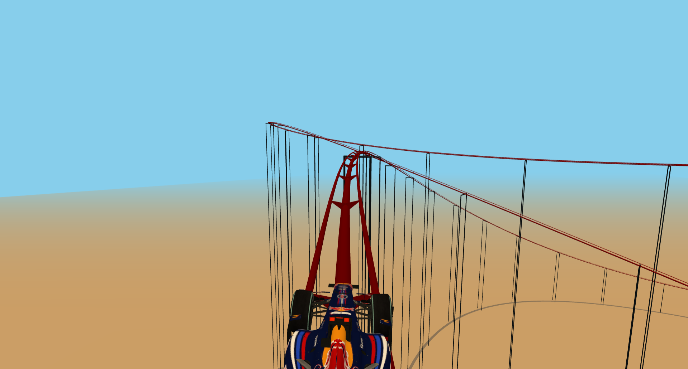

# Animator

A dynamic 3D roller coaster animation built with Angular and Three.js, featuring interactive mouse controls and realistic physics simulation.



## Features

- **3D Roller Coaster Simulation**: Experience a thrilling roller coaster ride with smooth parametric curves
- **Interactive Controls**: Use mouse drag to influence the camera and car movement
- **Realistic Physics**: Gravity, velocity damping, and acceleration smoothing for authentic motion
- **High-Quality Rendering**: Anti-aliasing, fog effects, and professional lighting
- **Responsive Design**: Adapts to window resize and different screen sizes

## Use Cases

### Waiting Screens
Perfect for loading screens or waiting animations in web applications. The continuous motion provides visual interest while users wait for content to load.

```typescript
// Integrate into your loading component
<app-animation></app-animation>
```

### Simulation Environments
Ideal for educational simulations, game environments, or interactive demos showcasing physics and 3D graphics.

### Background Animations
Add visual depth to dashboards, presentations, or any web application needing subtle but engaging background motion.

## Acknowledgments

- Built with [Three.js](https://threejs.org/) for 3D graphics
- Angular framework for component architecture
- Inspired by classic roller coaster simulations</content>